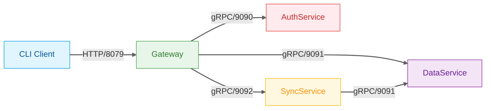

# Password Manager

[](https://golang.org/)
[](https://github.com/GlebRadaev/password-manager/actions/workflows/password-manager.yml)
[](https://goreportcard.com/report/github.com/GlebRadaev/password-manager)
[](https://codecov.io/github/GlebRadaev/password-manager)

**Password Manager** — A client-server system for secure storage of passwords, text/binary data with cross-device synchronization.

## Features

- User registration, authentication and authorization
- Secure storage for:
  - Login/password pairs
  - Arbitrary text data
  - Binary data
  - Bank card details
- Cross-device synchronization
- CLI client for Windows, Linux and macOS

## System Architecture



### Component Interaction:

1. **Client Side**:

   - CLI client communicates exclusively with Gateway via **HTTP** (port `:8079`)
   - Request format: REST/JSON
   - Gateway serves as single entry point (API Gateway)

2. **Server Side**:

   - Gateway routes requests to respective services via **gRPC**:
     - Authentication → AuthService(`:9090`)
     - Data operations → DataService (`:9091`)
     - Synchronization → SyncService (`:9092`)
   - All inter-service communication uses gRPC

3. **Port Mapping**:

| Service         | HTTP Port | gRPC Port | Primary Functions               |
| --------------- | --------- | --------- | ------------------------------- |
| **Gateway**     | `:8079`   | `:9089`   | Request routing, API entrypoint |
| **AuthService** | `:8080`   | `:9090`   | User management                 |
| **DataService** | `:8081`   | `:9091`   | Secure data storage             |
| **SyncService** | `:8082`   | `:9092`   | Cross-device synchronization    |

**Notes**:

- Core business logic implemented via gRPC
- Clients CANNOT access services directly (only through Gateway)

## Configuration

Main configuration file: `local.config.yaml` in root directory

## Installation

### Requirements

- Go 1.21+
- Docker и Docker Compose
- Protobuf Compiler

### 1. Build Project

```bash
# Clone repository
git clone https://github.com/GlebRadaev/password-manager.git
cd password-manager

# Install dependencies
make bin
make gen

# Build client for all platforms
make build-all
```

### 2. Start Server

```bash
# Build and launch via Docker
make run
```

### 3. Using the CLI Client

Compiled binaries are located in bin/ directory. Example usage:

```bash
# Show available commands
./bin/pm-linux-amd64 --help

# Example registration
./bin/pm-linux-amd64 register --username test --password test1234 --email test@test.com
```

### Documentation

- SSwagger UI available after launch at configured port: `http://localhost:{{port}}/swagger/`
- OpenAPI 3.0 specification: docs/swagger/
